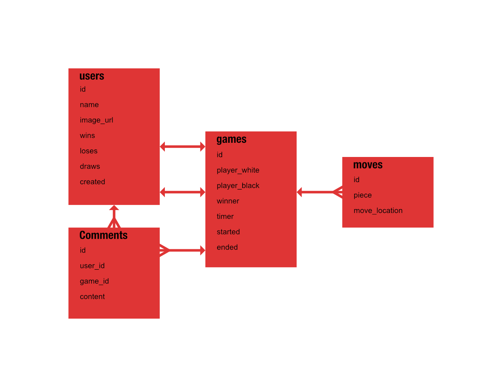

# Chess

## Provide a brief description about your project that answers the following questions:

### What problem or need does your project solve?

Imagine you love chess, but you have been banned from Chess.com, Lichess, and all the other thousands of chess websites on the web. Well you’re in luck! I plan to build a chess website where you can play against real human opponents. And you aren’t banned there yet!

### Who would be a user of your website?

People who want to play chess with other people in the internet.

What technologies will you be using?

* Node
* Express
* React
* Web Sockets
* PostgresQL

### Other Information

# Web Directory

## Provide a brief description about your project that answers the following questions:

### What problem or need does your project solve?

People who aren’t on social media aren’t missing much. But, if you are the kind of person who would like to be off social media, but not off the grid entirely, there should be a way to keep some point of contact up that is searchable, and doesn’t simply put your phone number or email up on the web.

I would build a website where users could post a photo, some basic information, whatever contact information they felt comfortable with and nothing else. Users could connect with one another, and might require a connection to share certain pieces of information that they had up about themselves. Users could, if they wanted, be searchable to the wider web and could be contacted through the service in a way that would not expose their email to strangers.

A service like this could open it’s API so that companies who wanted to make things like event planners, calendars, or post walls could connect to it and allow users to add functionality, choosing what parts of social media they wanted and didn’t want. The service itself would just be a directory, though.

### Who would be a user of your website?

People who want the directory part of facebook, and nothing else.

### What technologies will you be using?

* Node
* Express
* React
* PostgresQLÏ